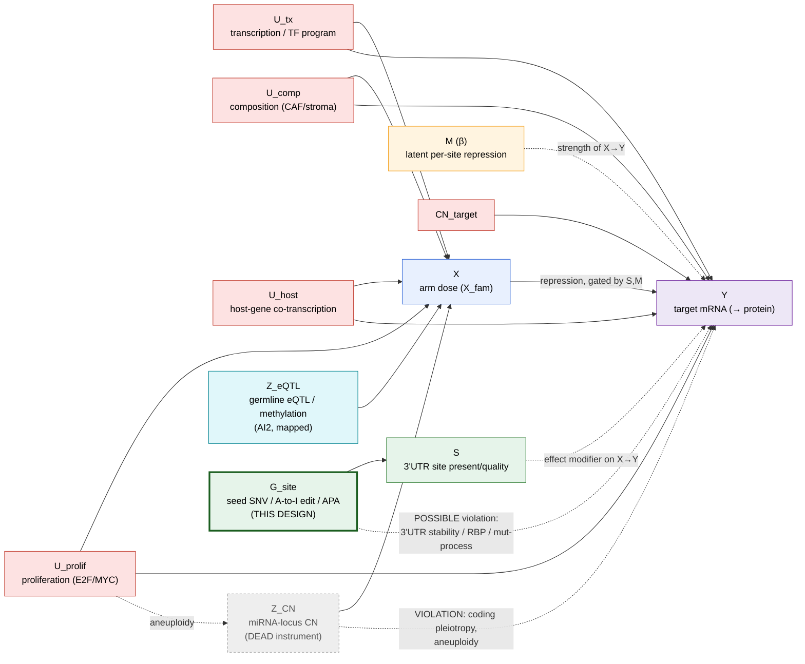

# Target-side seed-site perturbation — an edge-local instrument (design)

> **Goal:** specify a candidate exogenous handle for **edge existence** (Forward-Board §A) that acts on the
> 3′UTR **site**, not on arm dose — a within-tumour natural experiment (seed-disrupting **SNV** / **A-to-I
> editing** / **APA** shortening) whose exclusion restriction the CN instrument could never satisfy. This is
> the design object that formally links Board **§A** (edge existence — the one open foundation) to Board **§E**
> (target-side mechanism legs — the reference-blind quadrant), which are currently disconnected.
> **What belongs here:** the causal graph (nodes, back-doors, per-channel blindness), the identification
> argument (why the SNV×dose *interaction* is the identifying signal), the exclusion-violation ledger, the
> falsification ladder, and the phased build. NOT results (→ `DISCOVERY_REGISTRY.md` once anything runs), NOT
> the confound-block spec (→ `LEARNED_MODEL_METHODS §1`), NOT the CN-instrument history (→ `CN_INSTRUMENT.md`).
> **Update trigger:** when a leg (SNV / editing / APA) is built or benched, or the graph changes. Move rows
> to `built` as they land.
> **Sync-partner:** `docs/PROGRAM_FORWARD_BOARD.md` §A + §E (this note is their formal join);
> `docs/archive/LEARNED_MODEL_CHANNEL_FUSION_DESIGN.md` (the channel-fusion frame this is a new channel of);
> `docs/STATE_OF_PLAY.md` Axis 2 (edge existence).

> **Status: DESIGN ONLY — nothing built.** No registry row, no ledger row. Data-availability being verified
> before any planning commitment; do not cite any number here as measured.

---

## 0. The one-paragraph thesis

The program's entire edge-existence claim rests on **one observational line** (curated edges anti-correlate
more than abundance-matched site-free ones); both CN instruments are **retracted** because copy number moves
arm **dose** and drags a pile of co-amplified confounders with it (exclusion fails for ~54–73% of
well-instrumented edges — `CHANNEL_FUSION §2.1`, MH-133). The fix Board §A asks for is *"an asymmetry the
confound is blind to. Copy number cannot see a site type."* **A seed-disrupting 3′UTR variant is exactly that
asymmetry** — it perturbs the **edge structure** (the site), not the exposure (arm dose), so it is blind to
every back-door that killed the internal channels: composition, proliferation, host-gene co-transcription,
and target transcription. The identifying quantity is not a main effect but the **variant × arm-dose
interaction**: a genuine miRNA-site loss de-represses the target *only where the arm is loaded*; any
confound that acts additively on the target (mRNA stability, compartment, mutation burden) does not.

---

## 1. The causal graph



Read the graph as the repression relation `Y = transcription(U_tx, CN_target) − repress(X, S, M) + …`, where
**repression is a product of arm dose `X`, site presence `S`, and per-site weight `M`**. Everything red is a
confounder pointing at *both* `X` and `Y` — an open back-door on the `X→Y` arrow. That set is the reason every
internal lever landed "immaterial at n≈1000": they all condition on, or instrument, the **same** back-door
from redundant positions.

## 2. Per-channel blindness — why the graph predicts what died, and points where to go

| channel | graph position | blind to | **not** blind to (its violation) | measured verdict |
|---|---|---|---|---|
| **mRNA likelihood** | conditions on `C` at `Y` | — (adjusts what's in `C`) | anything **unmodelled** in `C` (the site-free null is heavy-tailed → the culprit is unmodelled) | the one observational line; per-edge null 3–4× too narrow |
| **Protein** | **downstream** of `M`, shares every upstream back-door with mRNA | nothing new | all of `U_*` | 4–6% of mRNA's Fisher info about β — **dead** (MH-108) |
| **State / healthy** | reprior on `M` across states | — | same edges, same confounds | τ ≈ 0, 0.6–0.7% info — **closed** (MH-102d) |
| **Z_CN** | instrument **upstream of X** | the `U_*` → `X,Y` back-doors (its whole appeal) | **coding pleiotropy** (`Z_CN→coding→Y`) + **aneuploidy** (`U_prolif→Z_CN`) | exclusion fails ~54–73%; `pi_causal=γ·b` was not an IV — **retracted** (MH-124r/133) |
| **Z_eQTL** | instrument upstream of X | `U_*` back-doors | eQTL pleiotropy; needs ancestry-PC C | mapped, unbuilt (AI2) |
| **G_site (this)** | instrument **on `S`, the edge itself** | **all** `U_*` back-doors *and* `X`-level confounds — it moves only the arrow | 3′UTR-local: stability / RBP-site / mutational-process (checkable, and **cancelled by the interaction**, §3) | untested |

The pattern is structural: **a channel adds identification only if it d-separates something the mRNA channel
can't.** Protein and state sit downstream/parallel and share the back-doors → they buy measurement error
reduction, never identification (the graph predicts their death a priori). CN sits upstream of `X` and is blind
to the `U_*` block — but is *cursed by its own pleiotropy* because a CN event moves everything co-located. The
seed-site channel is the only one that acts on `S`, downstream of every `U_*`→`X` path, so **none of the
confounds that killed the program can reach it through `X`.**

## 3. Identification — the variant × dose interaction is the whole game

A naïve "site-lost vs site-intact → is `Y` higher?" contrast is **not** clean: a 3′UTR variant can raise `Y` by
stabilising the transcript (removing an ARE/RBP site) with no miRNA involved, and tumours carrying such variants
differ systematically (mutation burden, APOBEC/MSI). Those are the `G_site ⇢ Y` violation arrows in the graph.

**The fix is the same asymmetry the program already trusts elsewhere (the AGO-gate interaction, Board §Y):
condition on dose and read the interaction.**

```
Y  ~  β_int · (site_disrupted × arm_dose)  +  β_1 · site_disrupted  +  β_2 · arm_dose  +  C  +  ε
```

- **`β_int` is the causal edge effect** and is the identifying coefficient. A genuine miRNA-site loss
  **de-represses only where the arm is loaded** ⇒ `site_disrupted × arm_dose > 0` on the `r = −resid(Y)`
  convention (loss of a repressor raises `Y`, dose-dependently).
- **Every additive confound cancels.** Transcript-stability effects, compartment, and mutation-process all
  load on `β_1` (the main effect of the variant) or on `C` — they move `Y` *regardless of arm dose*, so they
  do **not** enter `β_int`. This is exactly axiom 4: the artifact and the mechanism predict different things
  (additive vs dose-interacting), so the test *is* an arbiter.
- **Symmetric prediction for site-GAIN** (edit/APA-exposed / SNV creating a seed match): `β_int < 0`
  (acquired repression, dose-dependent).

This makes the seed-site instrument a **difference-in-differences on the edge**, not a mean contrast — and DiD
on the dose axis is what neutralises the 3′UTR-stability violation the graph flags.

## 4. Three legs of one instrument — and what each actually costs (census-grounded, 2026-07-18)

`S` can be perturbed three ways; they share the graph and the estimator, differ in event frequency **and in
data readiness** (verified against disk, §4.1):

1. **Seed SNV** — somatic 3′UTR point mutation that destroys (loss) or creates (gain) a 6–8mer seed match.
   Cleanest single-event semantics; **rarest** → per-edge underpowered, so this is a **set-level** test
   (aggregate `β_int` across many edges), matching the program's honest "distributional shift" framing.
   **Data: READY** — SNV/VEP tables + genomic site maps + expression + C all on disk (§4.1). **This is the P0/P1 leg.**
2. **A-to-I editing** — recurrent ADAR editing at/near seed sites; site-loss/gain. Per-sample and recurrent →
   *would* carry more power than SNVs. **Data: BLOCKED** — no REDIportal/DARNED/editing-site table on disk;
   must be sourced fresh. **Deferred pending acquisition.**
3. **APA / 3′UTR shortening** — proximal-polyA deletes distal sites. **Data: PARTIAL** — the on-disk APAatlas
   table (`breast_pdui_per_gene.tsv`) is **per-gene breast-cohort static** (already folded into the site map as
   `apa_shortened`/`breast_pdui`), **not** per-TCGA-sample. A per-sample `ΔPDUI × arm_dose` interaction needs the
   full `PDUI.txt.zip` (177 MB, APAatlas pan-cancer) unpacked and checked for per-sample TCGA-BRCA columns first.
   **Conditional on that inspection.**

Design once (the interaction estimator + the `C` reuse), run the ready leg first, and **triangulate** as the
other legs unblock: three perturbation mechanisms of the same site that violate exclusion *differently* (point
mutation vs editing enzyme vs polyadenylation) but agree on `β_int` is the over-identification the CN arc
never had. **But the SNV leg stands or falls on its own first** — triangulation is P3, not the entry claim.

### 4.1 Data status — verified against disk (census 2026-07-18)

| need | status | path |
|---|---|---|
| **genome-wide somatic SNV** (all genes — use THIS, not the panel table) | **READY, 924 samples** | `data/SNV/vcfs_SNV/*.raw_somatic_mutation.vcf` — raw Mutect2 WGS tumor/normal, all chr, ~64% `FILTER=PASS` |
| — 165 more samples' genome-wide VCFs | **BACKFILL-able** (access proven) | re-fetch from `annotations/SNV/gdc_mutect_wgs_manifest.tsv` → full 1,089 |
| ~~panel APM±1 Mb + VEP~~ (do NOT use for coverage — panel-bounded) | superseded by genome-wide | `data/SNV/vep_vcfs/`, `somatic_annotated/combined_snv_variants.parquet` |
| **seed-site map with genomic coords** (the load-bearing asset) | **READY** | `method_dev/site_ladder/utr_site_ladder_genomic.tsv.gz` — per (arm,gene,site): `chrom,g_start,g_end` + `type`, `PCT`, `site_manakov/tarbase/postar_ago/clip_any` |
| arm dose / X_fam + mRNA, participant-keyed (12-char barcode) | **READY** | `data_loaders.py::{load_mirna_arms,load_rna}`; X_fam per `learned/channel_cn.py` |
| confounder block C (composition/prolif/purity/target-CN/TF) | **READY — reuse as-is** | `learned/confounders.py`; `learned/data.py::assemble_gene` |
| **somatic-confidence filter** (FILTER=PASS, VAF, POPAF) | **READY — reuse** | `pipeline/SNV/somatic_filter.py` (VCF fields, *not* VEP) |
| **seed-disruption call** (loss/gain/neutral) — re-score the 6–8mer with `alt` vs `ref` | **NET-NEW** (sequence logic) | site map + reference 3′UTR seq |
| **barcode↔UUID join** (SNVs are UUID-keyed; expression is barcode-keyed) | **NET-NEW** (construct from sample sheet) | `annotations/SNV/samples.tsv` (`Case ID`↔`File ID`) |
| A-to-I editing sites | **ABSENT** | — (source REDIportal/DARNED) |
| per-sample APA/PDUI | **UNVERIFIED** | `data/external_cache/apaatlas/PDUI.txt.zip` (inspect) |

**VEP is NOT on the critical path** (user-caught, 2026-07-18). The SNV↔site link is a pure **coordinate overlap**
(`pos ∈ [g_start,g_end]`) against `utr_site_ladder_genomic.tsv.gz`, which is **3′UTR-by-construction** (lifted
from MANE `three_prime_utr` blocks) — so overlap *subsumes* the `3_prime_UTR_variant` consequence filter; we do
not need it. VEP is also the *wrong* tool for the disruption call: it annotates generic consequences and knows
nothing about miRNA seed matches, so **loss/gain requires re-scoring the seed k-mer with the `alt` allele**, not
a VEP term. The only pipeline piece still worth keeping is the **somatic-confidence filter** (VCF FILTER/VAF/POPAF)
to drop germline/artefact calls — also not VEP. (VEP's 3′UTR flag is retained only as an optional overlap
cross-check, not a gate.)

**Coverage — RESOLVED to genome-wide (2026-07-18).** The panel±1 Mb restriction (`apm_region_bed.py`) applies
only to the `vep_vcfs/` derivative; the **raw genome-wide Mutect2 VCFs are on disk** (`vcfs_SNV/`, all
chromosomes) so **the edge universe is NOT panel-bounded** — every Hallmark target gene's 3′UTR is callable. The
remaining bound is **sample count**: 924 samples have genome-wide VCFs vs 1,089 in the panel set (165 missing,
GDC-backfill-able). Recommended sequence: **run P0 on the 924 now** (if 924 × all-genes is already too thin, the
165 won't rescue it; if it's promising, backfill to 1,089 for the real run).

Net-new gating P0: (a) the seed-disruption re-score, (b) the barcode↔UUID map — both plumbing, not research. The
scientific unknowns are **power** (carrier count) and **coverage** (panel bound), which only the P0 count answers.

## 5. Exclusion-violation ledger (the honest part — must clear before any claim)

| violation | which leg | mitigation |
|---|---|---|
| 3′UTR variant alters mRNA **stability** independent of miRNA (ARE/RBP) | SNV, editing | the **interaction** cancels additive stability; additionally flag variants overlapping AU-rich/known RBP motifs |
| **mutational process** confound (APOBEC/MSI tumours differ) | SNV | mutation-burden + signature in `C`; interaction cancels its additive part |
| **selection** on the target's function ties variant presence to `Y` | SNV | require the site-match change to be the *mechanism*; negative-control: 3′UTR variants **not** in any seed site should give `β_int ≈ 0` |
| ADAR editing is itself **immune/IFN-driven** → correlates with composition | editing | composition already in `C`; interaction cancels additive; shuffle-edit null |
| APA is **proliferation-driven** (short UTRs in cycling cells) | APA | `U_prolif` in `C`; the dose interaction is the separator |
| **power** — few carriers per edge | all | set-level aggregate `β_int`; editing/APA for event count; report carrier counts, never a per-edge FDR on <N carriers |

## 6. Falsification ladder (must clear all — mirrors `CHANNEL_FUSION §3`)

1. **Negative control — seedless 3′UTR variants.** Variants in the 3′UTR but **not** touching any seed site of
   an expressed arm must give `β_int ≈ 0`. If they don't, `β_int` is picking up generic 3′UTR-variant biology,
   not the site. (This is the direct analog of MH-136's seedless-gene positive control.)
2. **Dose asymmetry is real.** `β_int` must be carried by the **arm-loaded** samples; stratifying on low arm
   dose must collapse it. If the "effect" is dose-flat, it's a stability/main-effect artifact.
3. **Sign-correct by direction.** site-**loss** ⇒ `β_int > 0` (de-repression); site-**gain** ⇒ `β_int < 0`.
   A mechanism that gives the same sign both ways is confounded.
4. **Shuffled-perturbation null.** Permute the variant/edit labels across samples (within mutation-burden
   stratum) ⇒ `β_int → 0`. A "gain" surviving the shuffle is leakage.
5. **Cross-leg agreement.** Where two legs (SNV / editing / APA) cover the same edge, their `β_int` must agree
   in sign — the over-identification check.
6. **Concordance with the observational line.** Edges with an independent `β_int` should be enriched among the
   curated anti-correlating edges — the point of the exercise is to give that one observational line a second,
   *exogenous* leg.

## 7. Phased build (gated — each phase must clear its §6 rung before the next)

- **P0 — feasibility census (cheap, no model).** Verified data on disk (SNV, APA, site maps) → count carrier
  events. This is the power gate.
  - **✅ P0a RUN (2026-07-18, measured, deduped) — over the CURATED 6,030-site universe × 924 genome-wide
    samples: `128` overlap events, `116/3,795` edges hit, `110` of them single-carrier, only `6` edges ≥2,
    `1` edge ≥5** (miR-3613-3p→SMAD2 = the promiscuous 392-gene arm, discount). 83/128 on CLIP-supported sites.
    ⇒ **per-edge is dead; SNV-alone on the curated universe is set-level-only and thin.** (Prediction confirmed.)
    Script: `scratchpad/p0a_snv_site_overlap.py`; source `data/SNV/vcfs_SNV/` (PASS only), coordinate overlap,
    inclusive-span (±1 convention to pin before any inferential run). *Feasibility count, not a finding — no
    registry row.*
  - ⬜ **P0b — the max-coverage version:** re-run against the **genome-wide/discovery** site map
    (`utr_site_ladder_genomic_discovery.tsv.gz` / scanMiR genome-wide), which enlarges the ~42 kb curated
    target space ~100× — the site axis, not the sample axis, is the binding limit. Sizes whether a set-level
    `β_int` is powered.
  - ⬜ **P0c — arm-expressed filter + barcode↔UUID join** on the surviving carriers (drops events where the
    arm is silent — those cannot show a dose interaction).
- **P1 — the negative control + one positive anchor.** Run rung 1 (seedless 3′UTR variants → `β_int ≈ 0`) and
  a known-edge anchor (a canonical HE edge with a recurrent seed variant) → confirm the estimator and the
  asymmetry before scaling.
- **P2 — set-level `β_int`** across all covered edges, with `C` reused from the learned prep, all §6 rungs.
- **P3 — editing + APA legs** and the cross-leg triangulation (rung 5).
- **P4 (only if P2/P3 pay) — fuse as a channel.** In the `CHANNEL_FUSION` frame, `β_int` per edge is one more
  Gaussian observation of the same `β_f`, with `s²` from the interaction SE — the site-channel term, admitted
  by the §5 exclusion ledger exactly as the CN channel is admitted by its T1/over-ID gate.

## 8. What this note deliberately does NOT claim

- It does **not** manufacture identification by being drawn — it is bookkeeping that (a) explains why the
  internal frontier is exhausted, (b) would have flagged both dead CN instruments structurally (a
  product-of-coefficients estimator that conditions on the mediator is visible on the graph), and (c) names the
  one move with the right graph position.
- `β_int` has its **own** bill: rare events (power), 3′UTR-local violations (§5), and the site-gain side
  reopens the uncalibrated-null problem (§A). It is a **candidate**, not a win.
- Per the measured-only gate: **no number in this note is measured.** P0 fills the first ones.
