# A · Framing

## The question

Three questions, one quantity — **miRNA "pressure"** on the 50 MSigDB hallmark programs:

1. Which hallmark programs are most **targeted** by high-evidence miRNAs?
2. Does miRNA pressure **anti-correlate** with hallmark target-gene expression — and is it **gated by AGO/RISC**?
3. How does it vary by **PAM50 / immune / stage** — and **what does the tumor acquire vs healthy breast**?

::: {.fragment}
*Cohort: TCGA-BRCA primary tumors (n ≈ 1,077). Edges: miRTarBase. Programs: MSigDB Hallmark.*
:::

## The objects

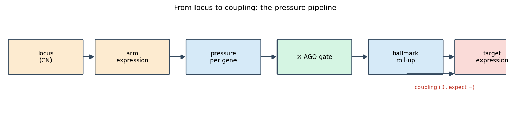

- **hallmark sets** (50, ~4,384-gene union) · **miRNA arms** (~515 ranked; 721 in the landscape) · **edges** (miRNA→target, high-evidence flag) · **AGO/RISC** (rate-limiting capacity) · **PAM50 / immune / stage** strata.

## The data

| source | modality | role |
|---|---|---|
| miRTarBase | curated miRNA→target edges | the regulatory map |
| MSigDB Hallmark | 50 gene sets | the program universe |
| TCGA-BRCA miRNA-seq / RNA-seq | log2(RPM+1) / log2(TPM+1) | pressure & readout |
| ASCAT3 | copy number | dosage |
| **GTEx-healthy + TCGA-NAT** | cross-state | the landscape |
| **CPTAC-2 prospective** | protein (TMT) | independent validation |
| **Buffa 2011** | independent miRNA+mRNA | replication |

# B · Method

## Step 1 — the edge map

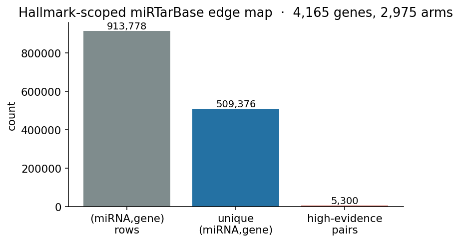{width="62%"}

- **Evidence tiers:** reporter / protein **>** RNA / perturbation **>** binding.
- **High-evidence** = ≥1 functional MTI **and** reporter-or-protein validation.

## Step 2 — pressure (key formula #1)

$$\text{pressure}(g,s)=\sum_{m\in R(g)} \underbrace{\mathrm{sm}(m,s)\,z(m,s)\,\log_2(\mathrm{RPM}{+}1)}_{\text{expression}}\;\cdot\;\underbrace{\frac{\log(1+\text{evidence}_\text{eff})}{\text{evidence\_mass}(m)}}_{\text{evidence}}$$

- **share** = the arm's slice of gene $g$'s regulator budget (softmax, sums to 1).
- **z** = does the arm *move* across tumors (the coupling signal).
- **log2(RPM+1)** = anchor to real abundance.
- spine **M0** = miRTarBase-only edges, S1 scorer (`softmax_z_logrpm`).

## 6a · The master equation

$$\text{pressure}(g,s)=\sum_{m\in R(g)} c(m,g,s),\qquad c=\text{expr\_mult}\cdot\text{edge\_w}$$

- **Sum, not mean** — total repressive load is *additive*; a gene crowded by many regulators is under more pressure.
- $c$ is the **atom**: every share, family and acquired number is built from it.
- Everything is **within-scope** (cohort vs one PAM50) — subtype tables are not cohort numbers re-sliced.

## 6b · The expression piece

$$\text{expr\_mult}=\underbrace{\mathrm{sm}(m,s)}_{\text{competition}}\cdot\underbrace{z(m,s)}_{\text{dynamics}}\cdot\underbrace{\log_2(\mathrm{RPM}{+}1)}_{\text{abundance}}$$

- **share** — arms *compete* for finite RISC on a gene → softmax over $R(g)$, centered on each arm's cohort median.
- **z** — the dynamics term coupling reads; *by design* a stably-high arm → $z\approx0$ → zeroed.
- **log2(RPM+1)** — keeps absolute level, so a share between two near-zero arms ≠ one between two abundant arms.

## 6c · The evidence piece

$$\text{edge\_w}=\frac{\log(1+\text{evidence}_\text{eff})}{\text{evidence\_mass}(m)},\quad \text{evidence}_\text{eff}=\text{confidence\_logclass}+0.5\,\text{enc\_depth}$$

- **assay-directness weights:** reporter 3.0 > protein 2.5 > RNA/perturb 1.5 > CLIP-binding 0.5.
- **log1p within each class** → diminishing returns, defuses publication-count bias.
- **÷ evidence_mass** = *promiscuity penalty* — a hub can't dominate every gene by breadth.
- **+ ENCORI AGO-CLIP** (α=0.5) — an orthogonal experimental layer on ~25% of pairs.

## 6d · Why three modes (the centering choice)

| mode | centering | answers |
|---|---|---|
| `softmax_z_logrpm` **(spine)** | tumor mean | "who **moves**" → coupling |
| `softmax_logrpm` (no-z) | none | "who **carries** pressure" → attribution + cross-state |
| `softmax_devhealthy_logrpm` | healthy median | "what the tumor **acquired**" |

*Attribution policy:* rank with `global_abs_share`, diagnose with `global_signed_share`, compute under no-z.

## Step 3 — the AGO/RISC gate (key formula #2)

:::: {.columns}
::: {.column width="52%"}
$$\text{gate}(s)=g_{\min}+(1-g_{\min})\,\sigma\!\big(k(\text{cap}(s)-c_0)\big)$$
$$\text{gated} = \text{pressure}\times\text{gate}(s),\quad \text{gate}\in[0.5,1]$$

- capacity = mean AGO1–4 z-score.
- **a documented sensitivity layer, not a causal model** — every result reported gated **and** ungated.
:::
::: {.column width="48%"}
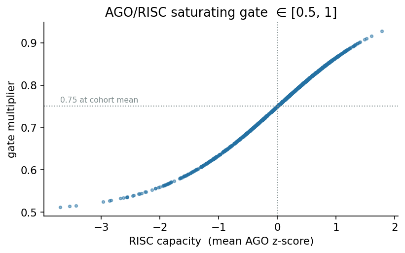
:::
::::

## Pressure cohort-wide — what it looks like

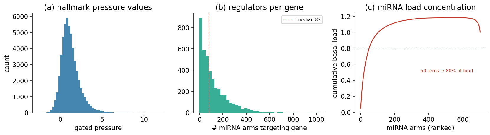

- structured, not noise: a heavy tail of hub arms carries most of the load; genes have many regulators.

## The two read-outs — and what each is for

:::: {.columns}
::: {.column width="50%"}
**Enrichment** — *"where do miRNAs aim?"*

- one-sided **hypergeometric** over-representation of high-evidence targets per hallmark, FDR across 50.
- descriptive; **uses no expression**.
:::
::: {.column width="50%"}
**Coupling** — *"is the pressure observed?"*

- partial **Spearman** of pressure vs target expression on a covariate ladder (raw → +CPE/HRD → +CN → +prolif).
- inferential; negative = repression realized.
:::
::::

## Pipeline at a glance

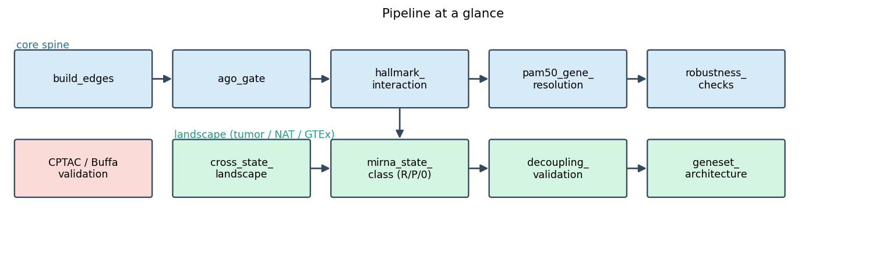

# C · Core results (single state)

## Result 1 — the targeting map

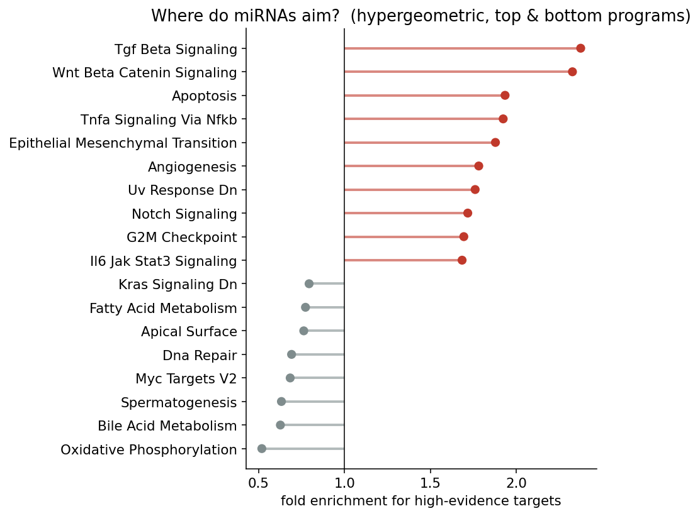{width="60%"}

- miRNAs buffer **signaling & plasticity** (TGF-β, WNT, apoptosis, NF-κB, EMT) — not housekeeping metabolism.

## Result 2 — hub miRNAs

:::: {.columns}
::: {.column width="55%"}
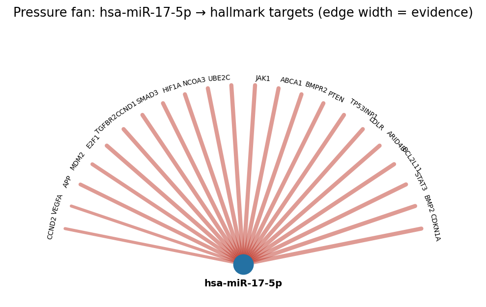
:::
::: {.column width="45%"}
- broadest regulators: miR-27a, miR-125b, **miR-21**, miR-34a (each ~44–45/50 sets).
- program leaders are the **canonical** ones: miR-34a→WNT, miR-29→EMT, miR-21/155→NF-κB, miR-17→TGF-β → internal-validity check.
:::
::::

## Result 3 — does pressure repress?

:::: {.columns}
::: {.column width="55%"}
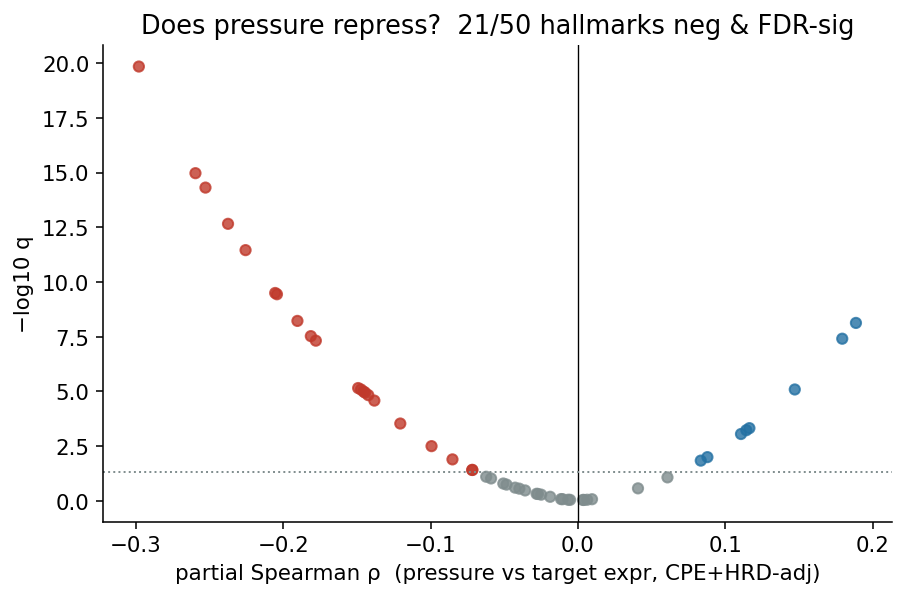
:::
::: {.column width="45%"}
- **26/50** gated-negative; **21/50** survive CPE+HRD (shown).
- positive couplings split into **proliferation** co-regulation (persists) vs a thinner **composition artifact** (collapses after purity/PAM50).
:::
::::

## Result 4 — the subtype hub

:::: {.columns}
::: {.column width="50%"}
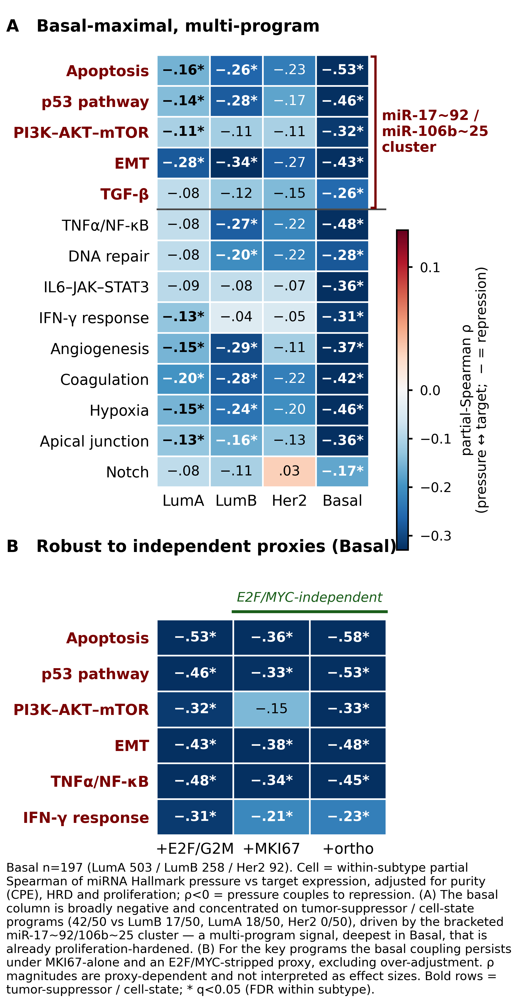
:::
::: {.column width="50%"}
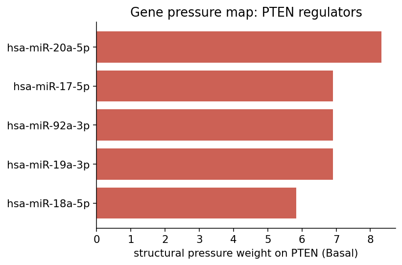
:::
::::

**Basal** concentrates pressure on tumor-suppressor / EMT nodes — **PTEN, BIM, FOXO1, CDKN1A, TGFBR2, VIM** — via **miR-17/20a/106b/23a/130b**.

## Result 5 — miRNA dosage

:::: {.columns}
::: {.column width="55%"}
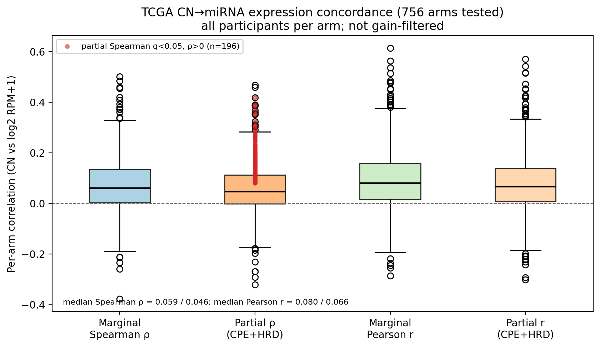
:::
::: {.column width="45%"}
- **237/756 arms** marginal positive locus-CN → expression concordance; **196/756** survive CPE+HRD partial.
- top: miR-151a at the **8q24 MYC/AGO2** amplicon; subtype hierarchy LumB≈Her2 > Basal > LumA.
- *refreshed 2026-06-24 under the S1+MIMAT spine.*
:::
::::

# D · The cross-state landscape

## From one state to three

A tumor-only snapshot can't say what's **acquired**. Add **GTEx-healthy → TCGA-NAT → TCGA-tumor** (721 arms / 5,108 edges).

Every edge carries **two** measurements:

- **pressure (potential)** = edge weight × abundance — cross-state-comparable (no-z).
- **coupling (realized)** = ESTIMATE+epithelial-adjusted partial-Spearman, **per state**.

## The acquired program

:::: {.columns}
::: {.column width="55%"}
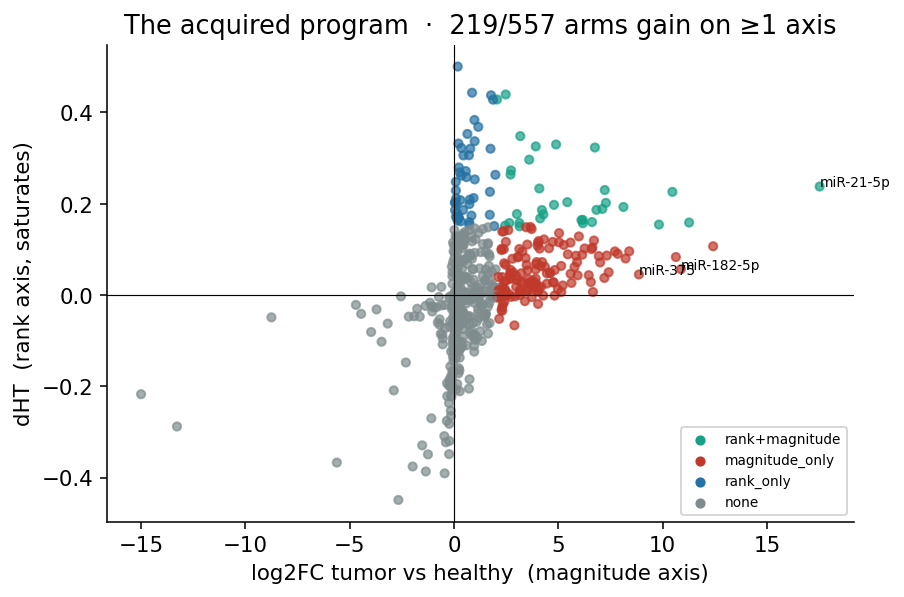
:::
::: {.column width="45%"}
- **241/721 arms gain** on ≥1 axis.
- rank `dHT` **saturates** → magnitude `log2FC` recovers the **oncomiR surge** (miR-182/183/375/93).
- top acquired = a coherent **miR-21 program**.
:::
::::

## The R / P / 0 method

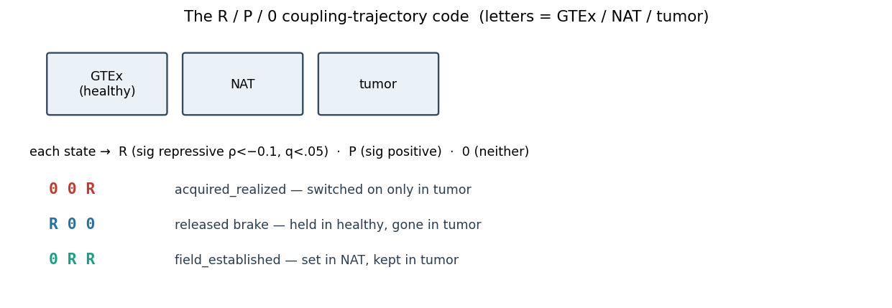

## Switched-on repression & released brakes

:::: {.columns}
::: {.column width="50%"}
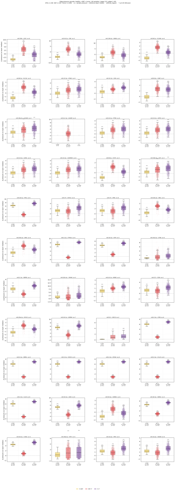
:::
::: {.column width="50%"}
**acquired_realized (610 edges)** — newly switched-on; highlight **miR-744-3p → HLA-G + TGFB1** (acquired immune-tolerance, *candidate*).

**released brakes (R00, 213 edges)** — healthy holds **ERBB2, CXCR4, MMP2/14, NOTCH2, BIM** repressed; tumor releases.
:::
::::

## Is the de-coupling real?

:::: {.columns}
::: {.column width="55%"}
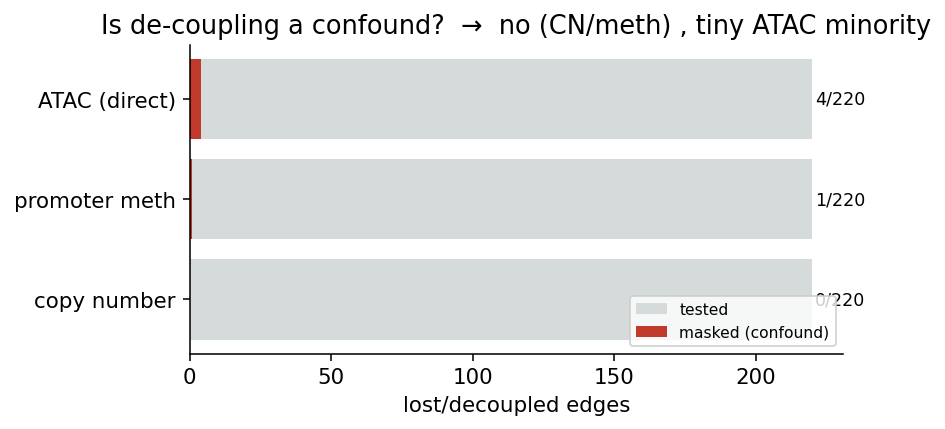
:::
::: {.column width="45%"}
- **not** copy number (0/220), **not** promoter methylation (1/188).
- small **4/134** direct-ATAC minority at growth/cell-cycle loci.
- ⇒ mechanism is **post-transcriptional / competitive** (APA, ceRNA, RISC).
:::
::::

## NMF — method & rationale

:::: {.columns}
::: {.column width="55%"}
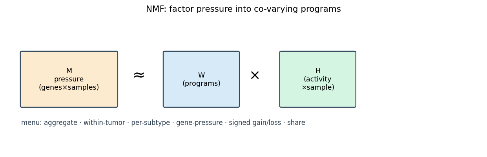
:::
::: {.column width="45%"}
factor pressure matrices into **co-varying programs**; the menu spans aggregate, within-tumor, per-subtype, gene-pressure, signed gain/loss, and share.

*factor indices renumber every rebuild → track the content `factor_label`.*
:::
::::

## NMF — selected results

:::: {.columns}
::: {.column width="55%"}
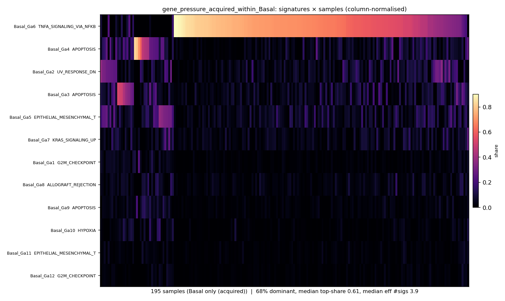
:::
::: {.column width="45%"}
- programs are **PAM50-divergent** (Basal TNFA/NFKB, q≈1e-139).
- but what each tumor **acquires** is one shared backbone (46% cohort / 68% Basal).
- **divergent baseline, convergent acquisition.**
:::
::::

## Gene-set architecture — the brake-release thesis

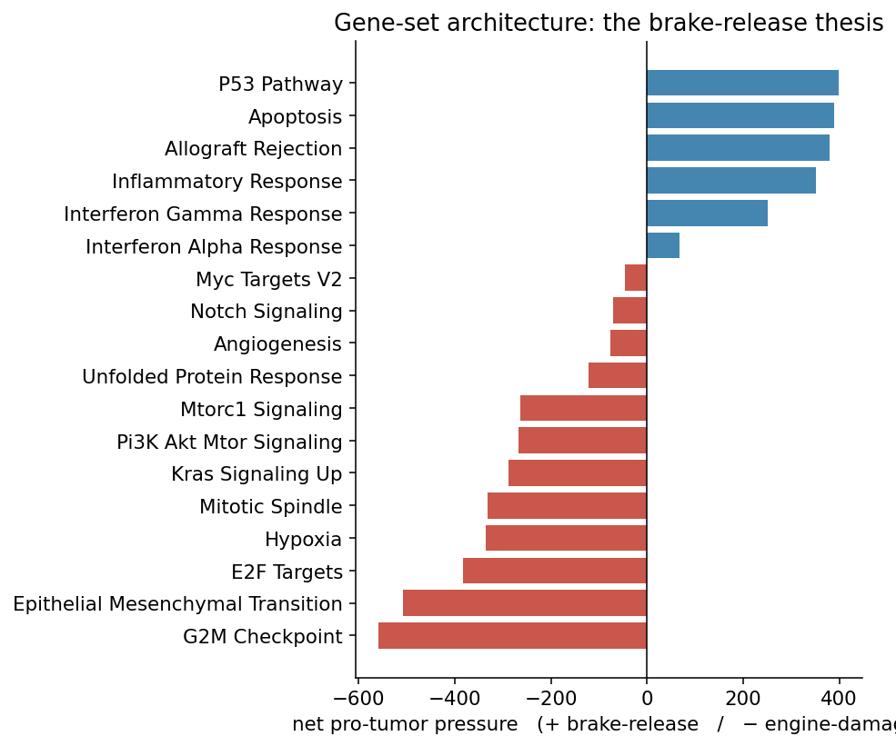{width="58%"}

**7,840** net-repressing vs **114** net-activating pairs: miRNAs **damage engines**, but their malignant effect is **brake-release on suppressive programs**. miR-21 #1 (93% acquired).

# E · Did we believe it?

## Robustness 1 — proliferation

:::: {.columns}
::: {.column width="55%"}
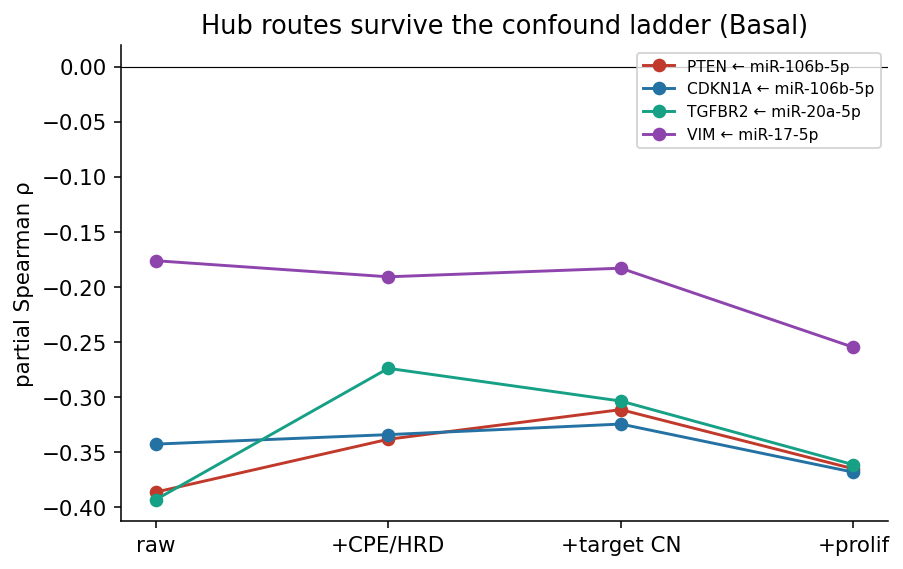
:::
::: {.column width="45%"}
- adjust on MKI67 / E2F-MYC-stripped G2M / PC1 → coupling **survives & strengthens** (8/8 key; Basal 41/50).
- proliferation is a **suppressor confound**. PTEN/CDKN1A/TGFBR2/VIM robust.
:::
::::

## Robustness 2 — curation bias

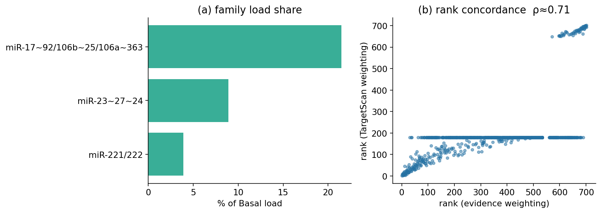{width="78%"}

miR-17-5p is #1 under evidence, binary **and** TargetScan weighting (ρ≈0.65). **Not** a curation artifact.

## Validation 1 — protein layer (CPTAC): mostly compartment

:::: {.columns}
::: {.column width="52%"}
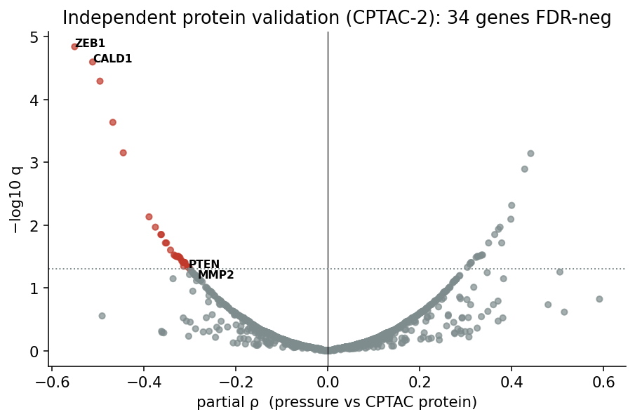
:::
::: {.column width="48%"}
Bulk protein **and** bulk miRNA are compartment-weighted averages ⇒ a miRNA in a *different cell type* anti-correlates with a protein **without repressing it**.

**The null settles it:** degree-preserving **shuffled non-edges** — which *cannot* repress — show the **same** compartment gradient as curated edges (**−0.129 vs −0.127**).

- **~57%** of the apparent protein repression is **compartment arithmetic** (HE genes 60%, orphan scan 56%).
- Adjusting for composition: FDR-neg **34 → 3**; **EMT −0.33 → +0.16**; **CALD1/MMP2 → ~0** (CAF markers).
- **The real effect survives as a SET** — compartment-blind, **p=2e-3**; individual edges are **underpowered at n=101** (~25% power), not absent.
:::
::::

## Validation 2 — orphan-blind discovery (composition-adjusted)

A **blind** scan of orphan edges (miRTarBase-absent) vs CPTAC protein. The scan was re-run with the **cell-composition block** it had been missing (MH-114):

- protein candidates **412 → 22**; translational **182 → 1**; translational+replicated **93 → 0**.
- but **attenuated, not absent**: the lost nominations stay negative as a set (**87% keep sign, p=4e-141**) — **56%** of their effect was compartment arithmetic, and the rest is below FDR resolution at n=101.
- survivors are **tumour-intrinsic**: miR-181b→IRS2, miR-29b→FOXO3, miR-195→PSMD7.
- *wet-lab nominations, not validated edges.*

## Validation 3 — independent cohort (Buffa)

:::: {.columns}
::: {.column width="55%"}
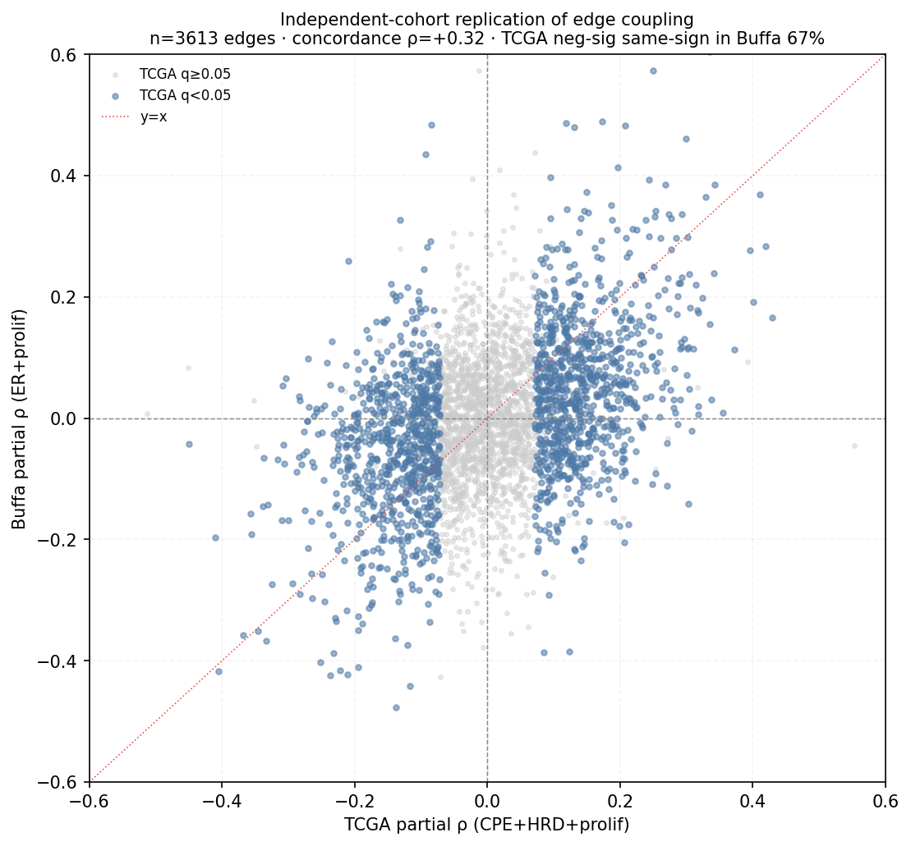
:::
::: {.column width="45%"}
207 paired breast tumors, **no TCGA overlap**: partial-ρ **concordance +0.32**, **67% sign-concordance**; **108 orphans triple-validated** (TCGA·CPTAC·Buffa).
:::
::::

## Scorecard

| Solid | Exploratory / candidate |
|---|---|
| targeting map | miR-744 → HLA-G immune edge |
| Basal tumor-suppressor hub | AGO-gate causality |
| proliferation robustness | de-coupling mechanism (APA/ceRNA) |
| CPTAC-2 protein validation | orphan nominations |
| brake-release architecture | |
| miR-29 → ECM orphan axis | |

# F · Wrap

## Limitations

- pressure is **associative**, not causal.
- miRTarBase **curation bias** → read rankings, not absolute folds.
- gene-gene topology can't see lipid-mediated inhibition (PTEN→PIP3).
- 164 `floor0` arms lack a healthy reference; AGO gate is a bounded heuristic.
- de-coupling mechanism not yet pinned; dosage module pre-MIMAT.

## What's next

- stratum-resolved within-PAM50 coupling.
- **pin the de-coupling mechanism** with the APM motif / SV / APA per-sample layer.
- loss-of-repression; fitted AGO×pressure; larger per-tumor ATAC; METABRIC.

## Takeaway

1. miRNAs target **signaling / plasticity** programs.
2. the malignant move across healthy→tumor is **brake-release on suppressive programs** — subtype-structured (**Basal miR-17~92 on tumor suppressors**; PTEN the through-line: core → landscape → CPTAC protein, where it is one of the few edges that keeps ~half its effect after composition).
3. it **replicates** at protein (CPTAC-2) — but only **as a set, and at ~40% of the naive size**: ~57% of the bulk-protein signal is **compartment arithmetic** (shuffled non-edges reproduce it), and n=101 cannot resolve individual edges at the true effect size. Buffa (mRNA, independent cohort) is the stronger replication.
   - ⚠ *"it reproduces in an independent cohort" is not evidence of biology when both cohorts share the confound* — the unadjusted protein signal reproduces **better** across cohorts precisely because the artifact does.

## Backup — formulas

- S1 evidence scorer (`confidence_logclass` weights) + ENCORI depth boost (α=0.5).
- no-z cross-state spine; healthy-anchored `dev` mode.
- hypergeometric enrichment; signed-path propagation (Katz α=0.25, 6 hops).
- gene-role malignancy + DepMap continuous weight.
- R/P/0 thresholds (|ρ|>0.10, q<0.05); arm-resolve Tier A/B/C.

*Sources: `docs/{FORMULAS,METHODS,LANDSCAPE_REPORT,CPTAC_VALIDATION_SESSION_SUMMARY}.md`.*
