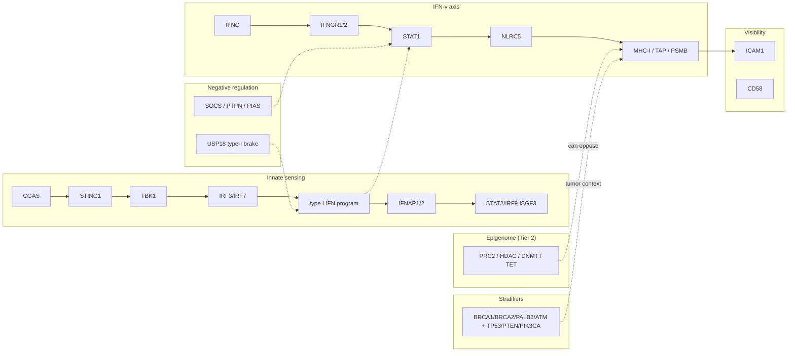

# 01 — Extended gene panel (tiered by modelling depth)

This document is the **canonical** description of every gene and lncRNA **named in tier lists** in `pipeline/config.py`, why it is there, how **functional categories** connect, and how tiers map to **pipeline integration depth**.

**Code is source of truth for symbols and order**: `PRIMARY_GENES`, `EXTENDED_PRIMARY_GENES`, `TIER1_LNCRNA_GENES`, `TIER2_MEDIUM_GENES`, `TIER3_CNV_ONLY_GENES`, `TIER_SNV_CNV_STRATIFIER_GENES`, `TIER4_READOUT_GENES`, and the derived unions `FULL_INTEGRATION_GENES`, `CNV_GENES`, `PIPELINE_GENE_PANEL`, `RNA_EXPRESSION_ALIAS_SEED_SYMBOLS` / `PANEL_ALIAS_SEED_SYMBOLS`.

**Naming note**: GENCODE v49 uses **`CGAS`** and **`STING1`**. External datasets may still say `MB21D1` / `TMEM173` / `STING`; the pipeline remaps those via `LEGACY_DATASET_SYMBOL_RENAMES` in `pipeline/config.py`.

---

## 1. How tiers map to modelling (integration depth)

| Tier | Config list(s) | Typical pipeline treatment |
|------|-----------------|------------------------------|
| **Core (frozen 66)** | `PRIMARY_GENES` | Full per-gene evidence in the regulatory graph (when the gene is in `PIPELINE_GENE_PANEL`): enhancer/promoter/TAD overlap logic, methylation/SV/CNV hooks as implemented for “primary” subjects. |
| **Tier 1 extension** | `EXTENDED_PRIMARY_GENES` | Same **full-integration** depth as core when `APM_USE_EXTENDED_GENE_PANEL=1` (default): folded into `FULL_INTEGRATION_GENES` and therefore default `PIPELINE_GENE_PANEL`. Includes **protein-coding** and **eight lncRNAs** (see §6). |
| **Tier 1 lncRNA subset** | `TIER1_LNCRNA_GENES` | Exact subset of lncRNA symbols inside `EXTENDED_PRIMARY_GENES` (same order as there). Used anywhere the code must refer to “first-class lncRNA subjects” without scanning the full extended list. |
| **Tier 2 medium** | `TIER2_MEDIUM_GENES` | **Not** in default `PIPELINE_GENE_PANEL`. Tracked at **medium depth**: expression + promoter methylation + CNV (see module docs); treated as **regulators / parallel programs**, not full enhancer-decomposition subjects. |
| **Tier 3 CNV-only** | `TIER3_CNV_ONLY_GENES` | Dosage-focused covariates: **CNV** integration; not expanded as full regulatory subjects. |
| **Stratifiers** | `TIER_SNV_CNV_STRATIFIER_GENES` | Tumor-state anchors that must appear as **named entities** in SNV/CNV/SV tables and model conditioning (e.g. **HRD genotype** via `BRCA1`/`BRCA2`; plus `TP53`/`PTEN`/`PIK3CA`). Not treated as full enhancer-decomposition APM subjects. |
| **Tier 4 readouts** | `TIER4_READOUT_GENES` | **Expression / phenotype labels** only: included in **RNA alias seeding** (`RNA_EXPRESSION_ALIAS_SEED_SYMBOLS`) for matrix harmonisation and Thorsson-style readouts; **excluded** from `CNV_GENES` and default `PIPELINE_GENE_PANEL`. |

**Composed sets (config)**

- `FULL_INTEGRATION_GENES` = deduped `PRIMARY_GENES` + `EXTENDED_PRIMARY_GENES` → default **`PIPELINE_GENE_PANEL`** when `APM_USE_EXTENDED_GENE_PANEL` is on.
- `CNV_GENES` = deduped `FULL_INTEGRATION_GENES` + `TIER2_MEDIUM_GENES` + `TIER3_CNV_ONLY_GENES` + `TIER_SNV_CNV_STRATIFIER_GENES` (Tier 4 **not** included).
- `RNA_EXPRESSION_ALIAS_SEED_SYMBOLS` = deduped union of **all** tier lists above **including** `TIER4_READOUT_GENES` (wider RNA vocabulary for aliases / QC).

**Environment switch**

- `APM_USE_EXTENDED_GENE_PANEL=0` → `PIPELINE_GENE_PANEL` reverts to **`PRIMARY_GENES`** only (legacy 66-gene runs).

**Counts (current `pipeline/config.py`; deduped where noted)**

<!-- GENERATED:panel_counts BEGIN -->
| List | Count |
|------|------:|
| `PRIMARY_GENES` | 66 |
| `EXTENDED_PRIMARY_GENES` | 32 (24 protein-coding + **8** lncRNAs) |
| `TIER1_LNCRNA_GENES` | 8 (subset of the lncRNAs above) |
| `FULL_INTEGRATION_GENES` | 98 (= deduped union of primary + extended) |
| `TIER2_MEDIUM_GENES` | 33 |
| `TIER3_CNV_ONLY_GENES` | 7 |
| `TIER_SNV_CNV_STRATIFIER_GENES` | 7 |
| `TIER4_READOUT_GENES` | 18 |
| `CNV_GENES` | 145 |
| `RNA_EXPRESSION_ALIAS_SEED_SYMBOLS` | 163 |
<!-- GENERATED:panel_counts END -->

---

## 2. Functional categories and how they connect

Genes are grouped below into **biological modules**. Tiers mix modules: the same module can appear at full depth (Tier 1) and again at readout depth (Tier 4) for different purposes (e.g. **CD8** as label vs **MHC** as mechanism).

### 2.1 Category definitions

| Category | What it captures | Representative genes (non-exhaustive) |
|----------|------------------|----------------------------------------|
| **A. Antigen presentation & processing** | Immunoproteasome, TAP, chaperones, MHC-I classical/non-classical | `PSMB8`–`PSME4`, `TAP1`/`TAP2`, `CALR`, `PDIA3`, `PDIA6`, `B2M`, `HLA-A`–`HLA-G` |
| **B. NK stress ligands & checkpoints** | NKG2D ligands, DNAM/PVR axis | `MICA`, `MICB`, `ULBP*`, `RAET1*`, `PVR`, `NECTIN2`, `NCR3LG1` |
| **C. IFN-γ / JAK–STAT & transcription** | Signal transduction, STATs, IRFs, NLRC5 (MHC-I transactivator) | `STAT1`, `STAT3`, `JAK1`, `JAK2`, `IRF1`, `IRF2`, `NLRC5`, `IFNG`, `IFNGR1`, `IFNGR2` |
| **D. Negative feedback & homeostasis** | SOCS, NF-κB damping, phosphatases, PIAS | `SOCS1`, `SOCS3`, `NFKBIA`, `TNFAIP3`, `PTPN2`, `PTPN11`, `PIAS1`, `PIAS3` |
| **E. Type-I IFN axis & innate sensing** | cGAS–STING–TBK1–IRF3/7, ISGF3, IFNAR | `CGAS`, `STING1`, `TBK1`, `IRF3`, `IRF7`, `STAT2`, `IRF9`, `IFNAR1`, `IFNAR2` (+ Tier 1 **`USP18`** as type-I–specific brake) |
| **F. MHC-I enhanceosome & peptide trimming** | RFX/NF-Y cofactors for NLRC5-dependent promoters; ERAP axis for HLA-E/NKG2A biology | Tier 1: `CIITA`, `RFX5`, `RFXAP`, `RFXANK`, `NFYA`, `NFYB`, `NFYC`, `POMP`, `CANX`, `ERAP1`, `ERAP2` |
| **G. Immune synapse / visibility** | Adhesion beyond peptide–TCR | Tier 1: `ICAM1`, `CD58` |
| **H. Growth factor / SMAD / STAT3 counter-axis** | EGFR/SRC/SMAD3; IL-6 family | `EGFR`, `SRC`, `SMAD3`, `TGFB1`, `IL6`, `IL6R`, `IL6ST` |
| **I. Immune checkpoints & shedding** | PD-L1/L2, ADAM-mediated ectodomain shedding | `CD274`, `PDCD1LG2`, `ADAM10`, `ADAM17` |
| **J. Epigenetic state (medium depth)** | Writers, erasers, PRC2, HAT/HDAC | Tier 2: `DNMT*`, `TET*`, `EZH2`, `SUZ12`, `EED`, `KDM6A`, `KDM4*`, `KDM5*`, `SETD2`, `HDAC*`, `KAT2A` |
| **K. Metabolic & parallel suppressive programs** | Trp–kynurenine, adenosine, CD47 | Tier 2: `IDO1`, `AHR`, `NT5E`, `CD47`, `LGALS9`, `CD276` |
| **L. NF-κB & nuclear transport (dosage)** | Rel family, importin/exportin | Tier 3: `NFKB1`, `NFKB2`, `RELA`, `RELB`, `REL`, `KPNA6`, `XPO1` |
| **M. Tumor stratifiers (SNV + CNV)** | Canonical BRCA tumor-state anchors incl. HRD genotype | `BRCA1`, `BRCA2`, `PALB2`, `ATM`, `TP53`, `PTEN`, `PIK3CA` |
| **N. Immune geography & readouts** | CYT, subsets, exhaustion, myeloid/TLS proxies | Tier 4: `GZMA`, `PRF1`, `CD8A`, `CD8B`, `CD4`, `FOXP3`, `NKG7`, `KLRD1`, `KLRK1`, `HAVCR2`, `LAG3`, `TIGIT`, `CTLA4`, `CXCL13`, `CCL2`, `CSF1`, `ENTPD1`, `SIRPA` |
| **O. First-class lncRNA regulators** | ceRNA / chromatin / nuclear speckle programs overlapping MHC and stress loci | `HCP5`, `HCG18`, `HLA-F-AS1`, `MICB-DT`, `LINC01149`, `NEAT1`, `MALAT1`, `HOTAIR` |

### 2.2 Connection graph (high level)

**How to read it**

- **Parallel axes**: IFN-γ (`STAT1` → `NLRC5` → MHC-I) and **cGAS–STING** (type I IFN) are both needed to separate *“IFN never started”* from *“IFN started then was extinguished”*—hence **`USP18`** at Tier 1.
- **Enhanceosome**: `NLRC5` in the core panel is mechanistically incomplete without **RFX / NF-Y / POMP / CANX** (Tier 1).
- **NK layer**: stress ligands in the core connect to **NKG2** readouts in Tier 4 (`KLRD1`, `KLRK1`, `NKG7`) without treating every NK marker as a regulatory *subject*.
- **Epigenome (Tier 2)** modulates accessibility of MHC and IFN programs; we track it at **medium depth** to avoid exploding enhancer-TAD work for every chromatin enzyme.
- **Stratifiers** anchor interpretation (e.g. **TP53** genotype, **PIK3CA** hotspot) without claiming full enhancer maps for those loci in the APM thesis.

---

## 3. Tier 0 — `PRIMARY_GENES` (frozen 66, protein-coding)

**Rationale**: Original **immune-visibility** circuit: MHC-I presentation, NK ligands, IFN-γ signaling, checkpoints, and selected negative regulators / co-signals. Frozen for backwards-compatible papers and `APM_USE_EXTENDED_GENE_PANEL=0` runs.

**Complete list (symbol order = config order)**

`PSMB8`, `PSMB9`, `PSMB10`, `PSME1`, `PSME2`, `PSME4`, `TAP1`, `TAP2`, `TAPBP`, `TAPBPL`, `CALR`, `PDIA3`, `PDIA6`, `B2M`, `HLA-A`, `HLA-B`, `HLA-C`, `HLA-E`, `HLA-F`, `HLA-G`, `MICA`, `MICB`, `ULBP1`, `ULBP2`, `ULBP3`, `RAET1E`, `RAET1G`, `RAET1L`, `PVR`, `NECTIN2`, `NCR3LG1`, `SOCS1`, `SOCS3`, `NFKBIA`, `TNFAIP3`, `STAT1`, `STAT3`, `JAK1`, `JAK2`, `IRF1`, `IRF2`, `NLRC5`, `CD274`, `PDCD1LG2`, `IFNG`, `IFNGR1`, `IFNGR2`, `ADAM10`, `ADAM17`, `TGFB1`, `IL6`, `IL6R`, `IL6ST`, `PIAS1`, `PIAS3`, `PTPN2`, `PTPN11`, `EGFR`, `SRC`, `SMAD3`, `EP300`, `CREBBP`, `CCL5`, `CXCL9`, `CXCL10`, `CXCL11`

---

## 4. Tier 1 — `EXTENDED_PRIMARY_GENES` (full integration extension)

**Rationale**: Closes mechanistic gaps relative to the frozen 66: **type-I IFN brake**, **MHC-I enhanceosome**, **cGAS–STING–IRF** axis, **ERAP/HLA-E–NK** axis, **immune synapse** visibility, and **eight lncRNAs** with MHC-linked or broad trans-regulatory evidence suitable for the same evidence layers as coding genes (within compute limits).

### 4.1 Protein-coding (Tier 1)

| Symbol | Category (§2) | Justification (compact) |
|--------|---------------|---------------------------|
| `USP18` | E | Type-I IFN–specific negative feedback; distinguishes sustained vs damped IFN states. |
| `ICAM1` | G | IFN-γ–co-regulated adhesion; positive control for intact inflammatory induction. |
| `CD58` | G | CD2-axis immune synapse ligand; immune evasion modality orthogonal to MHC.peptide alone. |
| `MYC` | L | Amplification-driven transcriptional reprogramming with direct relevance to MHC-I silencing; included at full depth to retain enhancer / architecture evidence. |
| `CIITA` | F | Master regulator analogue for MHC-II; included to anchor cross-pathway comparisons with `NLRC5`. |
| `RFX5`, `RFXAP`, `RFXANK` | F | RFX DNA-binding complex for SXY-type MHC promoters. |
| `NFYA`, `NFYB`, `NFYC` | F | NF-Y trimer binding Y-box; part of classical MHC-I regulatory architecture. |
| `POMP` | F | Proteasome maturation protein; immunoproteasome assembly context for `PSMB*`/`PSME*`. |
| `CANX` | F | Calnexin ER chaperone; folding/quality control alongside `CALR`. |
| `CGAS` | E | Cytosolic DNA sensor (GENCODE `CGAS`). |
| `STING1` | E | STING adaptor (GENCODE `STING1`; legacy aliases remapped in config). |
| `TBK1` | E | Kinase relay to IRF3/7. |
| `IRF3`, `IRF7` | E | IRFs driving type I IFN transcription. |
| `STAT2`, `IRF9` | E | ISGF3 components with `STAT1` for ISRE-driven programs. |
| `IFNAR1`, `IFNAR2` | E | Type-I IFN receptor chains. |
| `ERAP1`, `ERAP2` | F | Peptide trimming; HLA-E–VL9 and NKG2A axis (literature in §8). |

### 4.2 lncRNAs (Tier 1) — same list as `TIER1_LNCRNA_GENES`

| Symbol | Category | Justification (compact) |
|--------|----------|---------------------------|
| `HCP5` | O | MHC-linked locus; ceRNA / regulatory hub near stress-ligand region. |
| `HCG18` | O | ceRNA links to immune checkpoint–related targets in literature. |
| `HLA-F-AS1` | O | antisense / sponge programs intersecting HLA-F locus biology. |
| `MICB-DT` | O | locus-linked transcript; immune cell trait associations. |
| `LINC01149` | O | MHC-region GWAS-implicated long intergenic RNA. |
| `NEAT1` | O | Nuclear paraspeckle scaffold; broad immune–stress programs. |
| `MALAT1` | O | Nuclear speckle–associated trans regulator. |
| `HOTAIR` | O | Chromatin / PRC2-interacting archetype (interpret alongside Tier 2 PRC2 genes). |

**Config order (must match `EXTENDED_PRIMARY_GENES`)**  
<!-- GENERATED:extended_primary_config_order BEGIN -->
`USP18`, `ICAM1`, `CD58`, `MYC`, `CIITA`, `RFX5`, `RFXAP`, `RFXANK`, `NFYA`, `NFYB`, `NFYC`, `POMP`, `CANX`, `CGAS`, `STING1`, `TBK1`, `IRF3`, `IRF7`, `STAT2`, `IRF9`, `IFNAR1`, `IFNAR2`, `ERAP1`, `ERAP2`, `HCP5`, `HCG18`, `HLA-F-AS1`, `MICB-DT`, `LINC01149`, `NEAT1`, `MALAT1`, `HOTAIR`
<!-- GENERATED:extended_primary_config_order END -->

---

## 5. Tier 2 — `TIER2_MEDIUM_GENES` (medium depth)

**Rationale**: Programs that **reshape** immune visibility or IFN responsiveness (metabolism, adenosine, extra checkpoints, chromatin) without warranting full per-enhancer decomposition for each gene in the first iteration.

**Complete list (config order)**  
<!-- GENERATED:tier2_medium_genes_config_order BEGIN -->
`IDO1`, `AHR`, `NT5E`, `CD47`, `LGALS9`, `CD276`, `DNMT1`, `DNMT3A`, `DNMT3B`, `TET1`, `TET2`, `TET3`, `EZH2`, `SUZ12`, `EED`, `KDM6A`, `KDM4A`, `KDM4B`, `KDM4C`, `KDM5A`, `KDM5B`, `KDM5C`, `SETD2`, `HDAC1`, `HDAC2`, `HDAC3`, `HDAC4`, `HDAC5`, `HDAC6`, `HDAC7`, `KAT2A`, `PTPN1`, `PTPN6`
<!-- GENERATED:tier2_medium_genes_config_order END -->

| Block | Symbols | Role |
|-------|---------|------|
| Trp–kynurenine | `IDO1`, `AHR` | K metabolic immunosuppression + aryl hydrocarbon sensing |
| Adenosine / surface | `NT5E`, `CD47` | CD73 ectonucleotidase; CD47 “don’t eat me” on tumor cells |
| Extra immune modulators | `LGALS9`, `CD276` | TIM-3 ligand; B7-H3 checkpoint axis |
| DNA methylation | `DNMT1`, `DNMT3A`, `DNMT3B`, `TET1`, `TET2`, `TET3` | Writers/erasers of promoter methylation states |
| Polycomb / histone | `EZH2`, `SUZ12`, `EED`, `KDM6A`, `KDM4A/B/C`, `KDM5A/B/C`, `SETD2`, `HDAC1/2/3/4/5/6/7`, `KAT2A` | H3K27/H3K36/acetylation programs that intersect MHC-I silencing literature. We include complete KDM4/KDM5 and HDAC class I/II coverage (rather than a few “representatives”) because these families are routinely treated as druggable epigenetic axes in immune-reprogramming studies; partial family coverage reads as arbitrary and weakens committee defence. |
| Phosphatase family balance | `PTPN1`, `PTPN6` | Completes the PTPN family context already present in Tier 0 (`PTPN2`, `PTPN11`), because JAK–STAT dampening is a repeated failure mode in tumor IFN responsiveness. Including both helps avoid “single-member family” artifacts when stratifying on phosphatase-mediated resistance vs primary IFN-pathway lesions. |

---

## 6. Tier 3 — `TIER3_CNV_ONLY_GENES` (dosage)

**Rationale**: **Rel/NF-κB** and **nuclear transport** are dosage-sensitive and biologically tied to immune enhancers (e.g. MHC locus regulation), but full element-level modelling for each family member is deferred.

**Complete list (config order)**  
<!-- GENERATED:tier3_cnv_only_genes_config_order BEGIN -->
`NFKB1`, `NFKB2`, `RELA`, `RELB`, `REL`, `KPNA6`, `XPO1`
<!-- GENERATED:tier3_cnv_only_genes_config_order END -->

| Symbol | Notes |
|--------|--------|
| `NFKB1`, `NFKB2`, `RELA`, `RELB`, `REL` | NF-κB family members; context-dependent immune transcription. |
| `KPNA6`, `XPO1` | Nuclear import/export; mechanistic support roles (e.g. nucleo-cytoplasmic shuttling of regulators). |

---

## 7. Stratifiers — `TIER_SNV_CNV_STRATIFIER_GENES`

**Rationale**: This tier exists so key tumor-state anchors appear in **SNV/CNV/SV tables** and downstream models can condition on them explicitly without claiming full enhancer-architecture modelling for those loci. In BRCA, this includes **HRD genotype anchors** (`BRCA1`, `BRCA2`; plus `PALB2`, `ATM`) alongside canonical drivers (`TP53`, `PTEN`, `PIK3CA`).

**Complete list (config order)**  
<!-- GENERATED:stratifier_genes_config_order BEGIN -->
`BRCA1`, `BRCA2`, `PALB2`, `ATM`, `TP53`, `PTEN`, `PIK3CA`
<!-- GENERATED:stratifier_genes_config_order END -->

---

## 8. Tier 4 — `TIER4_READOUT_GENES` (labels / outcomes)

**Rationale**: Tier 4 is intentionally **small** and treated as **expression-only readouts** (labels), not regulatory *subjects* for enhancer-first modelling. It is used to seed RNA symbol harmonisation and to provide a compact set of “immune geography” markers.

**Explicit deferral (myeloid/stromal composition)**: Myeloid/stromal composition is **delegated to the Thorsson/Thornsson immune table** (`annotations/Thornsson_immune_table.tsv`) rather than expanding Tier 4 into a full immune atlas. That table already provides:
- CIBERSORT-derived immune cell fractions (e.g. `Macrophages M1/M2`, `Monocytes`, `Dendritic Cells Activated/Resting`, `T Cells CD8`, etc.)
- `Leukocyte Fraction`, `Stromal Fraction`, and `TIL Regional Fraction`

**Complete list (config order)**  
<!-- GENERATED:tier4_readout_genes_config_order BEGIN -->
`CXCL13`, `CCL2`, `CSF1`, `ENTPD1`, `SIRPA`, `GZMA`, `PRF1`, `CD8A`, `CD8B`, `CD4`, `FOXP3`, `NKG7`, `KLRD1`, `KLRK1`, `HAVCR2`, `LAG3`, `TIGIT`, `CTLA4`
<!-- GENERATED:tier4_readout_genes_config_order END -->

| Block | Symbols | Role |
|-------|---------|------|
| TLS / B-cell chemokine | `CXCL13` | Germinal-center / TLS geography proxy |
| Myeloid | `CCL2`, `CSF1` | Monocyte/macrophage recruitment programs |
| Adenosine (immune) | `ENTPD1` | CD39 on immune cells (parallel to tumor `NT5E`) |
| Macrophage receptor | `SIRPA` | “Don’t eat me” receptor (parallel to tumor `CD47`) |
| CYT / cytolytic | `GZMA`, `PRF1` | Cytotoxic score components |
| Lymphoid subsets | `CD8A`, `CD8B`, `CD4`, `FOXP3` | T-cell composition |
| NK | `NKG7`, `KLRD1`, `KLRK1` | NK activity / NKG2D axis readouts |
| Exhaustion / checkpoints | `HAVCR2`, `LAG3`, `TIGIT`, `CTLA4` | T-cell dysfunction programs |

---

## 9. miRNAs prioritised for panel-aware work

Arm-level ids below match `PANEL_MIRNA_TIER_ARM_IDS` in `pipeline/config.py` (MIMAT resolution via `mirna_mature_loci.csv` / alias registry).

| miRNA arm | Hypothesis / target link (summary) |
|-----------|--------------------------------------|
| `hsa-miR-148a-3p` | `CANX` / MHC-I visibility; `HLA-G` |
| `hsa-miR-152-3p` | `HLA-G` |
| `hsa-miR-9-5p` | `HLA-C` |
| `hsa-miR-125a-5p` | `TAP2`, `B2M` |
| `hsa-miR-125b-5p` | `B2M`, broader MHC-I |
| `hsa-miR-27a-3p` | `CALR` |
| `hsa-miR-34a-5p` | MHC-I, `CD274` |
| `hsa-miR-346-5p` | `TAP1` |
| `hsa-miR-200c-3p` | `CD274` |
| `hsa-miR-155-5p` | `SOCS1` (disinhibits JAK–STAT) |
| `hsa-miR-146a-5p` | `STAT1` |

---

## 10. Covariates vs panel subjects (explicit boundary)

The following belong in **cohort covariates / signatures** (see `pipeline/md/COHORT_COVARIATES.md` and `pipeline/covariates/`), **not** as automatic additions to `PIPELINE_GENE_PANEL`:

- **HRD / HRDetect / CHORD / Sig3**-style scores  
- **Hypoxia** metagenes  
- **Autophagy** transcriptional proxies  
- **PI3K pathway activity** composites  
- **TP53 / PIK3CA / PTEN** detailed mutation tables where those are richer than the stratifier tier alone

**Important representation rule**:
- **Stratifiers (`TIER_SNV_CNV_STRATIFIER_GENES`)** are *binary/categorical* condition variables derived from SNV/CNV/SV tables (e.g. “any LoF in `BRCA1`”, “`PIK3CA` hotspot present”, “`TP53` mutated”) used for cohort stratification and regression conditioning.
- **Covariate tables** capture *richer encodings* (hotspot-specific, clonality-aware, multi-hit classes, signature scores) when the modelling question needs more detail than a single indicator column.

This separation keeps the **regulatory graph** interpretable while still letting models condition on tumor state.

---

## 11. Literature anchors (committee defence)

- **MYC → MHC-I / immune evasion**: Casey et al. 2016 *Science* (MYC as a driver of immune evasion programs); Zimmerli et al. 2022 (MYC-associated antigen-presentation suppression programs; context varies by tumor type).  
- **HDAC / epigenetic repression of APM and reversal by inhibition**: Booth et al. 2018 *J Clin Invest* (epigenetic therapy restoring antigen presentation); Gomez et al. 2022 (HDAC/epigenetic modulation of MHC-I presentation; therapeutic re-sensitization literature).  
- **KDM family (H3K9/H3K36) and antigen presentation / IFN programs**: Zingg et al. 2017 *Cell Reports* (histone demethylase programs intersecting immune visibility; use as anchor for KDM4/5 rationale in Tier 2).  
- **HRD anchors as stratifiers**: BRCA1/2 and `PALB2`/`ATM` as canonical HRD-defining loci in breast cancer; use as genotype-first conditioning variables when testing HRD-linked rearrangement hypotheses.  
- NLRC5 / SXY enhanceosome and import: Downs 2016 *BioFactors*; reviews on RFX/NF-Y.  
- PRC2 vs MHC-I silencing: Nat Rev Cancer 2019; Cancer Cell 2019.  
- cGAS–STING–IRF3 axis: e.g. Advanced Science 2024 (doi on STING agonist / basal IFN context).  
- ERAP1/2 – HLA-E – NKG2A: Cell *Immunity* 2024.  
- HLA locus lncRNAs / ceRNA: representative PMC-indexed studies on `HCP5`, `HCG18`, `HLA-F-AS1`.  
- miR-148/152 → HLA-G; miR-148a → CANX/MHC-I: see PubMed / FASEB entries cited in earlier panel notes.

